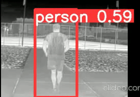
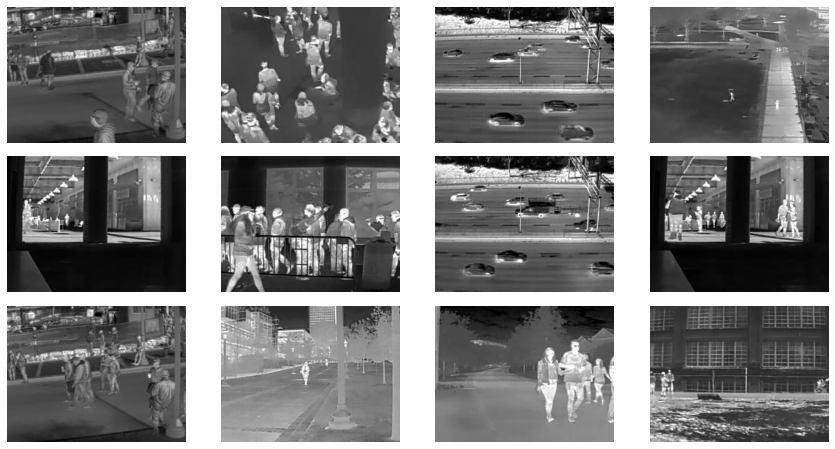
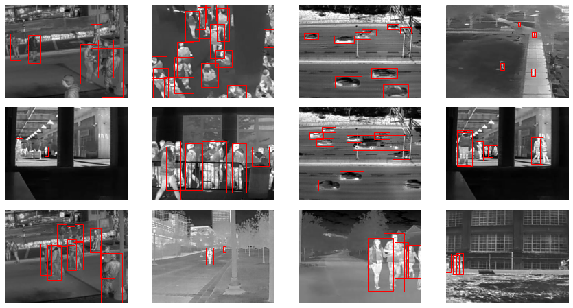
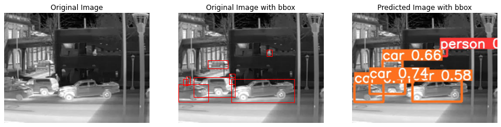

# Infrared Object Detection

<div align="center">
<p>
   <a align="left" href="https://ultralytics.com/yolov5" target="_blank">
   </a>
</p>
<br>
</div>

## **Model OUTPUT** Glimpse:



<br>

# Abstract : 

Infrared images are now being used worldwide for various applications, which makes this project more accountable.

**Detection of different objects** is an important task and can be used for self automation applications in the military as well as for common people.

# Dataset:

The CAMEL Dataset is led by Georgia Tech university under the guidance of professor Professor Saibal Mukhopadhyay, PI and Professor Marilyn Wolf, Co-PI and their students Evan Gebhardt
Burhan Ahmad Mudassar, Priyabrata Saha, Yun Long, Minah Lee, Jong Hwan Ko and Taesik Na.

It was published in the **2018 15th IEEE International Conference on Advanced Video and Signal Based Surveillance (AVSS)**
<div style="background:white;padding:5px;">

</div>
<br>

**Acknowledgement**:

E. Gebhardt and M. Wolf, “CAMEL Dataset for Visual and Thermal Infrared Multiple Object Detection and Tracking,” IEEEInternational Conference on Advanced Video and Signal-based Surveillance (AVSS), 2018.

P. Saha, B. A Mudassar, and S. Mukhopadhyay, “Adaptive Control of Camera Modality with Deep Neural Network-Based Feedback for Efficient Object Tracking,” IEEEInternational Conference on Advanced Video and Signal-based Surveillance (AVSS), 2018.

The data can be accessed through the below link:

* <a href="https://camel.ece.gatech.edu/">**CAMEL Dataset**</a>
<br>
<br>

# Some random images from training set


<br>
<br>

# Pre-Processed images with bounding boxes


<br>
<br>

# Data distribution

* 1-  12636 images for training
* 2-  3158 images for validation
* 3-  3158 images for testing
<br>
<br>

# Orgainizing directiories

Organize your train and val images and labels according to the example below.

`../datasets/infrared/images/train/1.jpg`<br>
`../datasets/infrared/labels/train/1.txt`


<br>
<br>

# Annotations format

* One row per object<br>
* Each row is `classes, center_x_coordinate, center_y_coordinate, width, height` format<br>
* Box coordinates must be normalized
* Class numbers are zero-indexed (start from 0)

<br>
<br>

# Classes

* 0 for **Person**
* 1 for **Bicycle**
* 2 for **Car**

<br>
<br>

# Training the YOLOv5 model

## Super Thankfull to : **https://github.com/ultralytics/yolov5**

**Prerequisites python>=3.8**

### Steps

* Clone the above Repository
* Create a virtual environment `conda create --name <env> --file requirements.txt`
* Install dependencies `conda install --file requirements.txt`
* Run the below code in the main directory for **CPU** training
* `python /yolov5/train.py --img 336 --rect  --batch 32 --epochs 20 --data /yolov5/data.yaml --weights yolov5s.pt  --name Result --cache`
* Run the below code in the main directory for **GPU** training
* `python /yolov5/train.py --img 336 --rect  --batch 32 --epochs 20 --data /yolov5/data.yaml --weights yolov5s.pt  --name Result --cache --device 0`
* Weights are stored in `yolov5/runs/train/Result/weights/best.pt` for best model
<br>
<br>

# Detection with the trained Model

* use detect.py to run the model on different type of inputs

`detect.py` runs inference on a variety of sources, downloading [models](https://github.com/ultralytics/yolov5/tree/master/models) automatically from
the latest YOLOv5 [release](https://github.com/ultralytics/yolov5/releases) and saving results to `runs/detect`.


```bash
python yolov5/detect.py --source 0  # webcam      --weights yolov5/runs/train/Result/weights/best.pt
                          img.jpg  # image
                          vid.mp4  # video
                          path/  # directory
                          path/*.jpg  # glob
```

# Visualizing model performance


<br>
<br>


<br>
<br>

# Packages Used
<div style="display:flex; flex-direction:row;">


</div><br>

<div style="display:flex; flex-direction:row;">


</div><br>

<div style="display:flex; flex-direction:row;">


</div>
<br>
<br>
<br>
<h1>Thank you for reading :-)</h1>